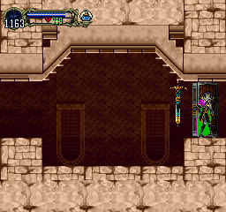
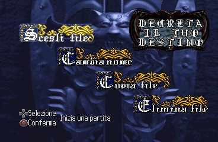

# Castlevania: Symphony of the Night - JP-ITA QHack v1.3

**English** | [Italiano](README.it.md)

Patch for the Japanese Rev 2 release of Castlevania: Symphony of the Night.

This patch combines the Italian translation v1.0 with the QHack v1.3 improvements. The original game is not included.

## Status

Automated integrity checks and targeted runtime tests pass. A full 201.1% playthrough has not been completed, so this release should still be treated as experimental.

If you find a crash, softlock, broken room, save problem or bad text/layout, please [open an issue](https://github.com/Bruc3Dev573/sotn-jp-ita-qhack/issues). Include the device or emulator, the base hashes, the patcher used and where the problem happened.

## Required base

- Serial: `SLPM_860.23`
- Track 1 MD5: `5021f600f109703170486dda1f0f86c1`
- Track 2 MD5: `3ea3346af023f84b1413c975d3c530fa`

Apply this patch to Track 1 after applying the Italian translation v1.0.

## Files

```text
patches/jp-ita-qhack-v1.3.ppf
patches/jp-ita-qhack-v1.3.sha256
```

Technical notes: [How it works](docs/how-it-works.md).

## Usage

1. Verify the Japanese Rev 2 disc MD5 checksums.
2. Apply the Italian translation v1.0 to Track 1.
3. Apply `jp-ita-qhack-v1.3.ppf` to the translated Track 1.
4. Keep the original Track 2 and update the CUE file with the local filenames.

Expected Track 1:

```text
SHA-256 d4d2e2e8eb60147e7efba79e78f9f1fc4383ccd59f280be7a4a39aa646effbbc
```

Patch checksum:

```text
SHA-256 62ff138defcd11d2b192b16407c3acffa5d33a5fc6b508ac277de2329e7b0853
```

## QHack features

- fullscreen gameplay without top and bottom black bars
- expanded tile maps
- rooms below the entrance hatch in both castles
- expanded menu backgrounds and frames
- castle gate exit blocked for Richter
- wolf-based Death skip blocked
- Royal Chapel boundary fixed
- loading rooms shown in white on the map
- stereo sound enabled by default

## Screenshots

| Fullscreen gameplay | Italian file menu |
|:---:|:---:|
|  |  |

## Credits

- [QHack v1.3](https://www.romhacking.net/hacks/3606/) by paul_met
- [Italian translation v1.0](https://www.romhacking.net/translations/1171/) by Gemini

Attribution and redistribution terms for original project material are in [`NOTICE`](NOTICE).

## Disclaimer

This patch was made on request. It is unofficial and comes with no warranty. Konami and the credited authors are not involved. You need your own copy of the game.

If you hold rights to material used here and want it removed, please open an issue. I will review the request and take down the affected files if needed.

This repository contains patch and checksum files only.
